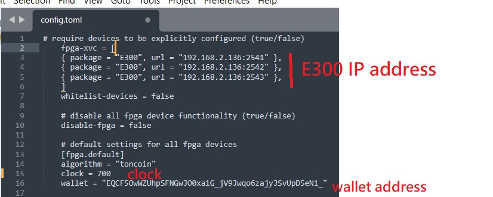

**Step 1**: Install docker 
    curl -fsSL https://get.docker.com -o get-docker.sh
    sudo sh get-docker.sh

**Step 2**: 
sudo docker run --name hashreactor --rm -t -i -v $(pwd):/app/config/ -v $(pwd):/app/cache/ --privileged --pull always korbin/hashreactor:rc config init

add E300 config  to the front of config.toml  (the same column; IP address need to change)

fpga-xvc = [
{ package = "E300", url = "192.168.2.139:2541" },
{ package = "E300", url = "192.168.2.139:2542" },
{ package = "E300", url = "192.168.2.139:2543" },
]

**Step 3**: Run 
sudo docker run --name hashreactor --rm -t -i -v $(pwd):/app/config/ -v $(pwd):/app/cache/ --privileged --pull always korbin/hashreactor:rc

**note**: you're able to run ton coin with clock 700 MHz ( clock can change int the config.toml file)

