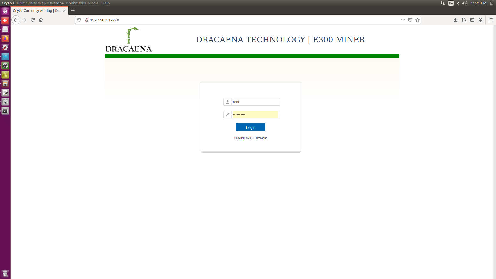
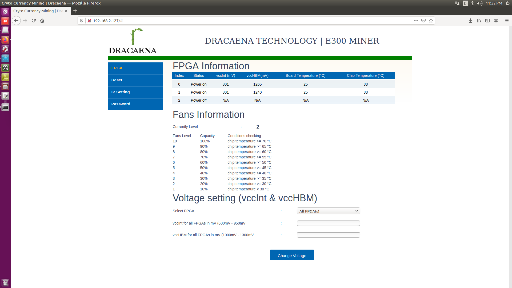
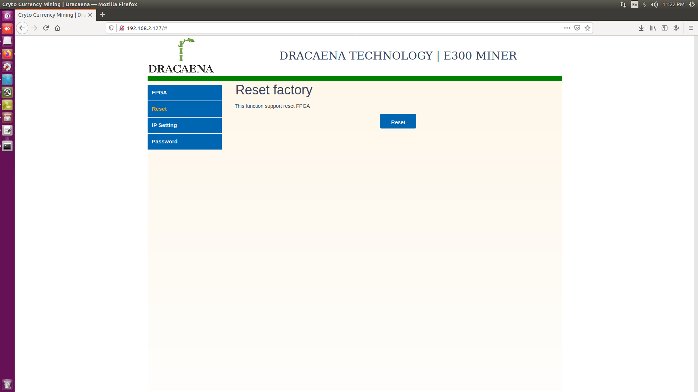
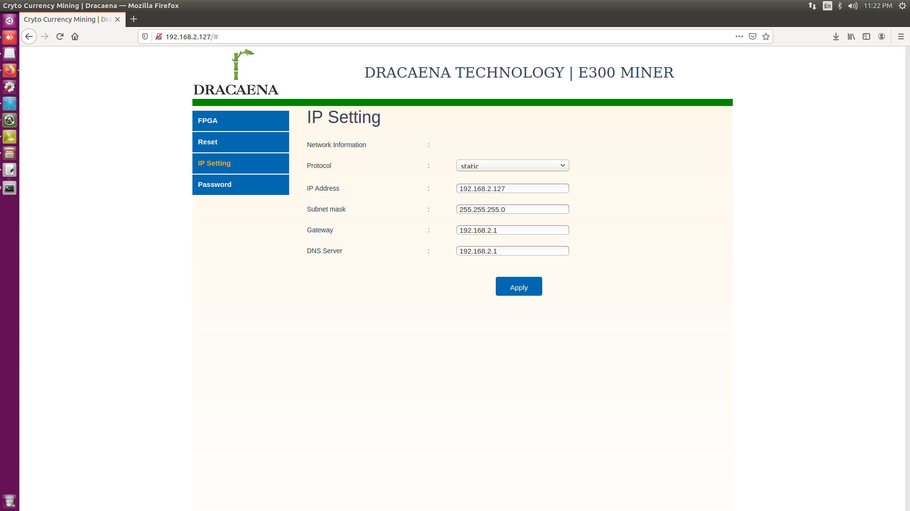
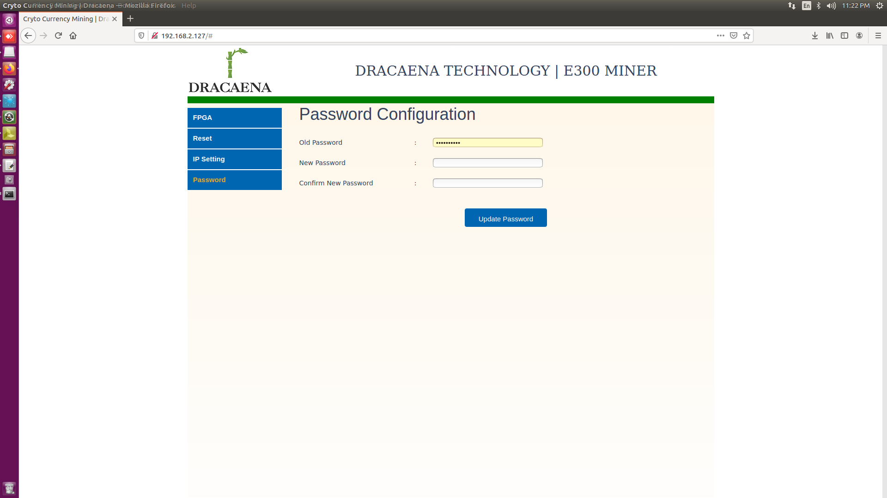

# 1. Web settings  (Installed on zynq board)
Install apache 2
```bash
	sudo apt update
	sudo apt install apache2 -y
```
download and install cgi file
```bash
	sudo cp qcmap_web_cgi.cgi /usr/lib/cgi-bin
	sudo cp qcmap_auth.cgi /usr/lib/cgi-bin
	sudo chmod 777 * /usr/lib/cgi-bin
 ```
Enable cgi mode
```bash
	cd /etc/apache2/mods-enabled
	sudo ln -s ../mods-available/cgi.load
	cd /var/www/html/
	sudo ln -s  /usr/lib/cgi-bin
 ```
 Update html file 
 
 ```bash
	sudo cp -R  * /var/www/html/
	sudo chown -R www-data:www-data /var/www/html/
 ```
 Restart apache service
 
 ```bash
	sudo /etc/init.d/apache2  restart
 ```

# 2. Manual guide for WebUI 
Login with your E300 Box IP's address 

Example : http://192.168.2.127/
Default username/password: root/123456890



Monitoring and changing vccInt/vccHBM of FPGA
=>click FPGA menu


Reset Voltage of FPGA by default
=>click "Reset" menu



Changing Network configuration
=>Click "Ip setting" menu


Changing login password
=>Click "password" menu


